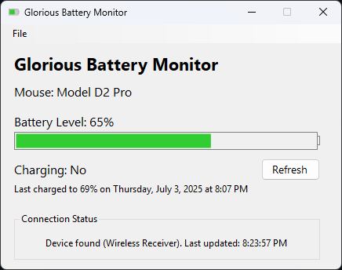

# Glorious Battery Monitor

A lightweight utility to monitor the battery of your Glorious mouse.

## Features

- **Battery level and charge status monitoring** for supported mice.
- **System tray icon** for quick access to battery status.
- **Low battery notifications**.
- **Customizable** update interval, notification threshold, and startup options.
- **Minimize to tray** and **close to tray** support.

## Screenshots




## Requirements

- Windows 10 version 1809 (build 17763) or later
- [Microsoft .NET 8.0 Desktop Runtime](https://dotnet.microsoft.com/en-us/download/dotnet/thank-you/runtime-8.0.17-windows-x64-installer)
- Supported Glorious mouse

## Installation

1. Download the latest release executable from [GitHub Releases](https://github.com/AwesomeTy18/GloriousBatteryMonitor/releases).
3. Run `GloriousBatteryMonitor.exe`.

## Usage

- The app runs primarily in the system tray and periodically checks your mouse's battery.
- The tray icon displays the current battery level and charging status. Hover over the tray icon for the exact percentage.
- Double-click the tray icon or use the context menu to open the main window.
- Adjust settings via the menu in **File>Settings**.
- Low battery notifications will appear when your mouse battery drops below your chosen threshold.

## Device Support

### Tested
Devices that have been confirmed to work with the application:
- Model D2 Pro 1k

### Untested
Devices that have not been tested but should work:
- Model D2 Pro 4k/8k
- Model D Minus Wireless
- Model D Wireless
- Model O2 Pro 4k/8k
- Model O2 Pro 1k
- Model O Minus Wireless
- Model O Wireless
- Model O Pro
- Series One Pro
- Series Two Pro

### Currently Unsupported
Support for these devices may be added in the future:
- Model D2 Wireless
- Model I2 Wireless
- Model O2 Mini Wireless
- Model O2 Wireless
- Model O Wireless Classic

## Building from Source

1. Clone the repository:
	```
	git clone https://github.com/AwesomeTy18/GloriousBatteryMonitor.git
	cd GloriousBatteryMonitor
	```
2. Restore the project's dependencies:
	```
	dotnet restore
	```
3. Build the project:
	```
	dotnet build
    ```
4. Run the project.
	```
	dotnet run
	```

## Dependencies

- [HidSharp](https://github.com/mikeobrien/HidSharp) (for HID device communication)
- [Microsoft.Toolkit.Uwp.Notifications](https://github.com/CommunityToolkit/WindowsCommunityToolkit) (for toast notifications)